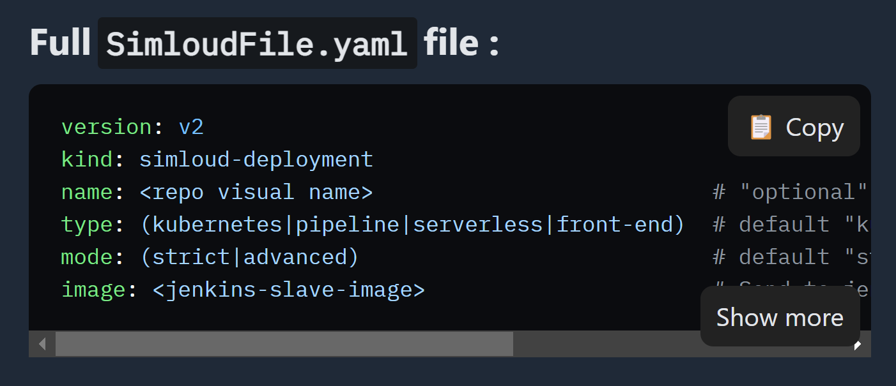

# rehype-starry-night-copy-collapse

Rehype [Starry Night](https://github.com/wooorm/starry-night) syntax highlighting plugin with "show more"/"show less" and "copy" buttons.



Tested on `"astro": "^1.5.2"`

## Install

```bash
yarn add -D rehype-starry-night-copy-collapse
# or
npm i -D rehype-starry-night-copy-collapse
```

## Usage

### Using with Astro

```js
// astro.config.mjs
import { defineConfig } from "astro/config";
import rehypeStarryNightCopyCollapse from "rehype-starry-night-copy-collapse";

// https://astro.build/config
export default defineConfig({
  markdown: {
    extendDefaultPlugins: true,
    rehypePlugins: [rehypeStarryNightCopyCollapse],
    syntaxHighlight: false,
  },
});
```

### Adding global styles

1. Add (Starry Night CSS)[https://github.com/wooorm/starry-night#css] to your project

````bash

```css
/* HIGHLIGHT GENERAL */
.highlight {
  position: relative;
}

/* COLLAPSE BUTTONS */
.source-highlight-wrapper.source-show-compacted .source-expanded {
  display: none;
}

.source-highlight-wrapper.source-show-compacted .source-compacted {
  display: block;
}

.source-highlight-wrapper.source-show-expanded .source-compacted {
  display: none;
}

.source-highlight-wrapper.source-show-expanded .source-expanded {
  display: block;
}

.source-highlight-wrapper .source-show-more,
.source-highlight-wrapper .source-show-less {
  user-select: none;
  position: absolute;
  bottom: 0;
  right: 0;
  z-index: 300;
  cursor: pointer;
  background-color: #6a6a6abb;
  color: #fff;
  padding: 7px 10px;
  border-radius: 8px;
  margin-bottom: 7px;
  margin-right: 7px;
}

/* COPY BUTTON */
.highlight .source-copy {
  user-select: none;
  display: none;
  position: absolute;
  top: 0;
  right: 0;
  z-index: 300;
  cursor: pointer;
  background-color: #6a6a6abb;
  color: #fff;
  padding: 7px 10px;
  border-radius: 8px;
  margin-top: 7px;
  margin-right: 7px;
}

.highlight:hover .source-copy {
  display: inline;
}
````

## License

[MIT](/license) © [Marat Dospolov](https://dospolov.com)
